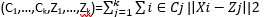

---
title: Cluster Analysis using Python and R
date: "2020-05-09T22:40:32.169Z"
description: Demonstrating how Cluster Analysis can be done using Python and R
---


## Goal of Cluster Analysis

 - The goal of cluster analysis is to **partition** the data into **distinct sub-groups or clusters** such that observations belonging to the same cluster is very similar or **homogeneous** and observations belonging to different clusters are **different or heterogenous.** 
 - The measurement of **similarity** may be **distance, correlation, cosine similarity** etc. depending on the **context/domain** of the problem.

### Youtube Tutorial

Link to Clustering concepts [Hierarchical clustering using Python](https://www.youtube.com/channel/UC-0ozvsLZBVTC31JqpKflGw).

### Application of Clustering

 - One very popular application of cluster analysis in business is **market segmentation.** Here, customers are grouped into distinct clusters or market segments and **each segment is targeted with different marketing mix** such as different promotional messages, different products, different prices, and different distribution channels.

 - Other example of clustering may be **clustering of products** into different sub-groups based on attributes like price-elasticity, genres etc.

 - In a way, clustering **compresses** the entire data into a reduced set of **sub-groups.** So, clustering is a data reduction technique.

### K-Means Clustering

 - The idea behind K-mean clustering is that a good clustering is one for which within-cluster variation is as small as possible. 

 - The one possible measure of within-cluster variation for the kth cluster is the sum of all the pairwise distsance between the observations in the kth cluster, divided by the total number of observations in the kth cluster. 

 - The total within-cluster variation is sum of the all within-cluster variation for 1 to kth cluster. 

 - Minimizing this total within-cluster variation is the optimization problem for K-means clustering.

 - K-means algorithm provides a local optimum- nevertheless, a good solution to the above optimization problem. 

### K-Means Algorithm

 1.  Randomly assign a number, from 1 to K, to each of the observations. These serve as     initial cluster assignments for the observations.
 2.  Iterate until there is no change in cluster centroids (change is below a tolerance limit):
    - For each of the K clusters, compute the cluster centroids. The kth cluster centroid is the vector of all the feature means for the observations in the kth cluster. 
    - Assign each observation to the cluster whose centroid is closest. 

### Mathematical perspective of clustering

 - Let C1,…, Ck denote sets containing the indices of the observations in each cluster. The set should satisfy two properties:
    1. C1 ∪ C2 ∪ … Ck = {1,…,n}. That is each observation belong to at least one of the k clusters.
    2. Ci ∩ Cj =∅ for all i≠j.  No observation belongs to more than one cluster.
 - K-means cost Function:
    - Let Z1,…,Zk are the cluster centroids. 
    - Cost 


### Isues with K-Means Clustering

 Because, k-means algorithm finds a **local** rather than a **global optimum.** The result depends on **initial random cluster assignment.** Hence, it is important to run the algorithm **multiple times** from different random initial configurations. Then select **the best solution** for which **the total within-cluster variation** is **smallest.**

### How many clusters to extract?

 - Decide the number of clusters which is most interpretable and actionable.
 - Other Guidelines: 
    - Plot of k-means cost versus K.
    - Silhouette score
    - Visualizing data on the first two Principal Components.

### Python Code for K-Means

```python
# k-means clustering
import pandas as pd
import matplotlib.pyplot as plt
import numpy as np
from sklearn.cluster import KMeans
from sklearn.preprocessing import StandardScaler
from sklearn.decomposition import PCA
from sklearn.metrics import silhouette_score
# load  data 
df=pd.read_csv("H:/Data/USArrests.csv")
pd.options.display.max_columns=5
df.head()
df.shape
df1=df.iloc[:,1:] # removing the string column from the data
df1.head()
# Standardization of features 
scaler=StandardScaler()
X=scaler.fit_transform(df1)
X
# Fitting 2 clusters (arbitary choice)
kmeans=KMeans(n_clusters=2,n_init=20,random_state=0).fit(X) 

# Cluster memberships 
labels=kmeans.predict(X)   
labels

# cluster size
np.unique(labels, return_counts=True)
 
#cluster means(centroids) 
df['cluster']=labels # add clustership as new column
df.groupby('cluster').mean()

# Deciding the optimal number of clusters in kmeans
k_range=range(2,11)
sil_score=[]
twss=[]

for k in k_range:
    cluster=KMeans(n_clusters=k, n_init=10,random_state=42)
    cluster.fit(X)
    label=cluster.predict(X)
    ss=silhouette_score(X,label)
    sil_score.append(ss)
    twss.append(cluster.inertia_)
    

# plot Number of clusters versus twss
plt.plot(k_range,twss,'ro-')
plt.ylabel("twss")
plt.xlabel("number of cluster")

# k versus silhouette
plt.plot(k_range,sil_score,'ro-')
plt.ylabel("Silhouette_score")
plt.xlabel("number of cluster")

# View the data along the first two  principal components 
T=PCA(n_components=2).fit_transform(X)
df2=pd.DataFrame(T,columns=['PC1','PC2'])
plt.figure(figsize=(10,10))
plt.scatter(df2.PC1,df2.PC2)

# Fitting 4 clusters based on wss plot 
kmeans=KMeans(n_clusters=4, n_init=10,random_state=0).fit(X) 

# Cluster memberships 
labels=kmeans.predict(X)   
labels

# add cluster membership as a new column
df2['cluster']=labels

# view 4 cluster on PC plot
plt.figure(figsize=(10,10))
plt.scatter(df2.PC1,df2.PC2,c=df2['cluster'],s=50,cmap='rainbow')

# cluster means/centroid
df1['cluster']=labels
df1.groupby('cluster').mean()

# which States in which cluster
df['cluster']=labels

df[df.cluster==0] # cities in cluster=0

df[df.cluster==1] # cities in cluster=1

df[df.cluster==2] # cities in cluster=2

df[df.cluster==3] # cities in cluster=3

# cluster size
np.unique(labels,return_counts=True)

# scatter plot with state names 
fig, ax = plt.subplots(figsize=(10,10))
x=df2.PC1
y=df2.PC2
ax.scatter(x,y,c=labels,s=50, cmap="rainbow") 
plt.xlabel('PC1')
plt.ylabel('PC2')
for i, txt in enumerate(df.State):
    ax.annotate(txt, (x[i], y[i]))

```
### R code for K-Means Clustering

```r

# clustering-kMeans
# load the data
data <- read.csv("H:/Data/USArrests.csv")
# view the first six rows
head(data)

# choose 4 numerical variables from the data
df <- data[,2:5]
head(df)
str(df) # structure of data

# standardize the variables of data 
dfNorm <- as.data.frame(scale(df))

# apply 2 clusters
clus_k2 <-kmeans(dfNorm,centers=2)  
clus_k2

# cluster means/centroids in terms of original variable value
aggregate(df,by=list(cluster=clus_k2$cluster),mean) # cluster means

#Decide the optimal value of k
twss <- numeric()
set.seed(1235)

for (k in 1:10){
  # For each k, calculate  tot.withinss
  wss[k] <- kmeans(dfNorm,centers = k)$tot.withinss
}


# plot of Total within-cluster sum of squares versus  k
p2 <- plot(1:10,wss,type = "b",xlab = "number of cluster",ylab = "wss")


#Choose 4 clusters based on elbow criteria
clus_k4 <-kmeans(dfNorm,centers=4)

#cluster membership
clus_k4$cluster

# cluster sizes
clus_k4$size

# cluster means
clus_k4$centers

# cluster means/centroids
aggregate(df,by=list(cluster=clus_k4$cluster),FUN=mean) # cluster means

# Plot the observations along the principal components
pc <- prcomp(df,center=TRUE,scale. = TRUE)
pc <- pc$x[,1:2]
plot(pc)

# plot of 4 clusters on principal component plot
plot(pc,col=clus_k4$cluster,pch=16)

# which States in which cluster
data$cluster <-  clus_k4$cluster # add the cluster member ship as new column
data$State[data$cluster==1]
data$State[data$cluster==2]
data$State[data$cluster==3]
data$State[data$cluster==4]

```

### References 

 1.  Mitchell, T. M. (1997). Machine Learning. New York: McGraw-Hill 
 2. Murphy, Kevin P.(2012). Machine Learning: A Probabilistic Perspective. Cambridge, MA: MIT Press
 3.  Gareth James, Daniela Witten, Trevor Hastie, Robert Tibshirani. (2013). An introduction to statistical learning : with applications in R. New York :Springer